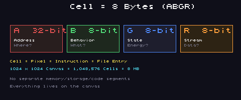
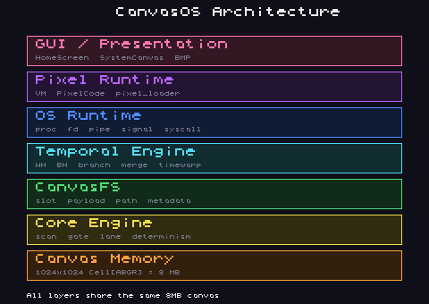
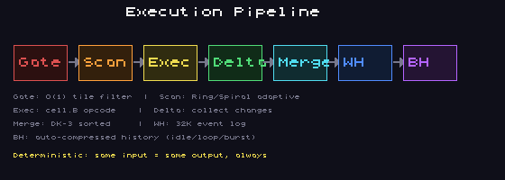
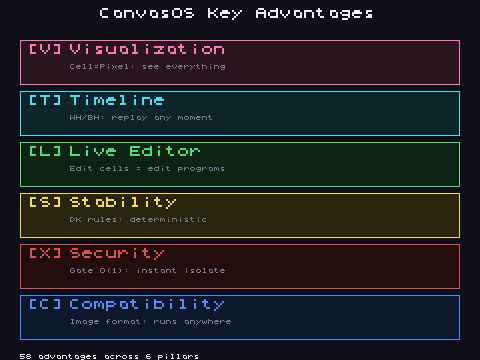

# SJ CanvasOS

**A spatial operating system where memory, files, execution, and time converge on a single 2D canvas.**

**메모리, 파일, 실행, 시간이 하나의 2D 캔버스 위에서 수렴하는 공간형 운영체제.**

[]()
[]()
[]()
[]()

---

## Overview / 개요

CanvasOS는 1024×1024 캔버스 격자 위에 VM 명령어를 셀로 심어 프로그램을 실행합니다.
모든 상태 변화는 WhiteHole 로그에 기록되어 결정론적 재생과 시간 여행이 가능하며,
분기(branch)로 캔버스를 병렬 현실로 분리한 뒤 다시 병합할 수 있습니다.

CanvasOS runs programs by planting VM instructions as cells on a 1024×1024 canvas grid.
Every state mutation is recorded in the WhiteHole log, enabling deterministic replay and time travel.
Branches split the canvas into parallel realities that can be independently evolved and merged.

---

## Cell Data Model (ABGR) / 셀 데이터 모델



캔버스의 모든 셀은 **8바이트**이며, ABGR 4채널로 구성됩니다.

| Channel | Size | Role / 역할 |
|---------|------|-------------|
| **A** | 32-bit | Address — 공간 좌표, lane_id, 조건코드 |
| **B** | 8-bit | Behavior — opcode (명령어 종류) |
| **G** | 8-bit | State — 에너지, 플래그, 길이 |
| **R** | 8-bit | Stream — 데이터 페이로드 바이트 |

> **Cell = Pixel = Instruction = File Entry**
> 메모리, 코드, 파일, 화면이 분리되지 않습니다. 하나의 캔버스가 전부입니다.

---

## Architecture / 아키텍처



```
┌──────────────────────────────────────────────────────────┐
│  GUI / Presentation   HomeScreen · SystemCanvas · BMP    │
├──────────────────────────────────────────────────────────┤
│  Pixel Runtime        VM · PixelCode · pixel_loader      │
├──────────────────────────────────────────────────────────┤
│  OS Runtime           proc · fd · pipe · signal · syscall│
├──────────────────────────────────────────────────────────┤
│  Temporal Engine      WH · BH · branch · merge · timewarp│
├──────────────────────────────────────────────────────────┤
│  CanvasFS             slot · payload · path · metadata   │
├──────────────────────────────────────────────────────────┤
│  Core Engine          scan · gate · lane · determinism   │
├──────────────────────────────────────────────────────────┤
│  Canvas Memory        1024×1024 Cell[ABGR] = 8 MB        │
└──────────────────────────────────────────────────────────┘
```

모든 레이어가 동일한 8MB 캔버스를 공유합니다.

---

## Execution Pipeline / 실행 파이프라인



```
Gate → Scan → Exec → Delta → Merge → WH → BH
```

| Stage | 설명 |
|-------|------|
| **Gate** | O(1) 타일 필터링 — 4096개 게이트로 접근 제어 |
| **Scan** | Ring(MH)/Spiral 적응형 스캔 |
| **Exec** | cell.B opcode 실행 (VM fetch-decode-execute) |
| **Delta** | 변경사항(Δ) 수집 — 원본은 불변 |
| **Merge** | DK-3 셀 인덱스 오름차순 정렬 후 병합 |
| **WH** | WhiteHole: 32,768 이벤트 순환 로그 |
| **BH** | BlackHole: 자동 압축 히스토리 (idle/loop/burst) |

---

## Key Advantages / 핵심 장점



### 1. Visualization / 시각화
- **Cell = Pixel**: 프로그램 상태가 곧 이미지. 디버깅이 눈에 보임
- 5가지 시각화 모드: ABGR, Energy 히트맵, Opcode 색상, Lane, Activity
- Gate 격자 오버레이로 접근 제어 상태 실시간 확인

### 2. Timeline / 타임라인
- **WhiteHole**: 모든 이벤트 기록 — 완전한 감사 추적(audit trail)
- **BlackHole**: 자동 압축 — idle/loop/burst 패턴 인식
- `timewarp <tick>`: 어떤 시점이든 되돌아가기
- 분기(branch) + 병합(merge): git처럼 캔버스를 분기

### 3. Live Editor / 라이브 에디터
- 셀 편집 = 프로그램 편집. 실행 중에도 수정 가능
- PixelCode REPL: `@(x,y)` `B=01` `G=FF` `!` 로 즉시 반영
- 자체 호스팅: echo, cat, info 등이 캔버스 위 PixelCode로 실행

### 4. Stability / 안정성
- **DK-1~5 결정론 규칙**: 동일 입력 → 동일 출력, 항상
- 에너지 기반 스케줄링: 선점(preemption) 없음, 데드락 불가능
- 정수 연산만 허용 — 부동소수점 비결정성 원천 차단
- FNV-1a 해시 검증: 상태 무결성 언제든 확인

### 5. Security / 보안
- **Gate O(1) 격리**: 타일 1개 닫기 = 영역 즉시 차단
- 4096개 독립 게이트: 프로세스별 공간 격리
- 규칙 하나로 보안 정책 변경 — 복잡한 설정 불필요
- 모든 작업 WH에 기록 → 위변조 감지 용이

### 6. Compatibility / 호환성
- **이미지 포맷 무임승차**: Cell 데이터 = RGBA 이미지
- CVP 파일: 스냅샷 + 리플레이 캡슐 (자기 완결형)
- SJ-Stream Packet: 1024B 고정 크기 스트리밍 프로토콜
- BMP 출력: 어디서든 결과를 이미지로 확인
- Linux, Android, 크로스 플랫폼 빌드

---

## GUI System / GUI 시스템

CanvasOS는 두 레이어로 구성된 픽셀 기반 GUI를 포함합니다:

| Layer | 설명 |
|-------|------|
| **Inner (SystemCanvas)** | 사각형 요소 배치, 드래그, z-order. 개발자용 |
| **Outer (HomeScreen)** | 모바일 홈 화면 스타일. 아이콘 그리드, 상태바. 사용자용 |

**GUI-Engine Bridge**로 엔진과 연결:
- Cell → Pixel 실시간 변환 (5가지 시각화 모드)
- Gate 격자 오버레이 (열림=초록, 닫힘=빨강)
- WH/BH 타임라인 바
- GUI 터치 이벤트 → WH 기록

---

## Quick Start / 빠른 시작

```bash
cd build

# 전체 테스트 빌드 및 실행
make test_all CC=clang

# GUI-Engine Bridge 테스트 (24 tests)
make gui_bridge_test

# GUI 단독 테스트 (17 tests)
make gui_test

# SJ-Stream Packet 테스트
make stream_test

# 라이브 데모
make demo_patchF && ./examples/demo_patchF

# Tervas 캔버스 터미널
make tervas && ./tervas

# ASan/UBSan 빌드
make sanitize

# 릴리스 검증
make release_check
```

---

## Shell Commands / 셸 명령어

| Command | Description / 설명 |
|---------|---------------------|
| `echo <text>` | 텍스트 출력 (PixelCode) |
| `cat <path>` | 파일·가상경로 출력 |
| `info` | 시스템 정보 |
| `hash` | 캔버스 해시 (FNV-1a) |
| `ps` | 프로세스 목록 |
| `kill <pid>` | 시그널 전송 |
| `ls / cd / mkdir / rm` | 파일시스템 조작 |
| `snapshot <name>` | CVP 스냅샷 저장 |
| `branch create\|list\|switch` | 분기 관리 |
| `merge <a> <b>` | 분기 병합 |
| `timewarp <tick>` | 시간 여행 |
| `timeline` | 타임라인 상태 |
| `det on\|off` | 결정론 모드 전환 |

---

## Test Suite / 테스트 스위트

```
Core Engine:     5 suites — scan, gate, canvasfs, scheduler, cvp
Phase 6:         6 tests  — Deterministic core
Phase 7:        10 tests  — Tervas canvas terminal
Phase 8:        18 tests  — Kernel primitives
Phase 9:        20 tests  — PixelCode VM
Phase 10:       20 tests  — Userland
Bridge:         16 tests  — System bridges
Patch B-H:      70 tests  — CanvasFS/Pipe/Self-host/Timewarp/Render/QA/Stress
SJ-Stream:       1 test   — 1024B packet roundtrip
GUI:            17 tests  — Buffer/Font/Element/HomeScreen/Event
GUI-Bridge:     24 tests  — Cell vis/Gate overlay/Timeline/Event→WH
───────────────────────────────────────────────
Total:         201+ tests — 0 failures
```

---

## Project Structure / 프로젝트 구조

```
build/
├── src/                    — C 소스 (~55 모듈)
│   ├── tervas/             — Tervas 터미널 (6 모듈)
│   ├── canvasos_gui.c      — GUI 시스템 (500줄)
│   ├── gui_engine_bridge.c — GUI↔Engine 브릿지
│   ├── sj_stream_packet.c  — SJ-Stream 패킷 프로토콜
│   ├── workers.c           — 멀티스레드 실행 (pthread)
│   └── ...
├── include/                — 헤더 파일 (~60개)
├── tests/                  — 테스트 스위트 (15+ 파일)
├── tools/                  — 이미지 생성기, GUI 데모
├── docs/                   — 설계 문서 + 다이어그램 이미지
├── examples/               — 데모 프로그램
├── devdict_site/           — 개발자사전 웹 대시보드
├── Makefile                — 빌드 시스템
└── VERSION
```

---

## Build Requirements / 빌드 요구사항

- C11 compiler (clang or gcc)
- POSIX threads (pthread)
- Tested on: Linux x86_64, Android aarch64

## Benchmark / 벤치마크

```
Stress test: ~246M ticks/s on aarch64
50-run determinism: identical hash across all runs
500-tick throughput: < 0.001 ms/tick
```

---

## License / 라이선스

CanvasOS — sjpupro-lab

## Contact / 연락처

SJPUPRO@GMAIL.COM — Busan, South Korea / 부산, 대한민국

## Repository

https://github.com/sjpupro-lab/SJ-CANVAOS
